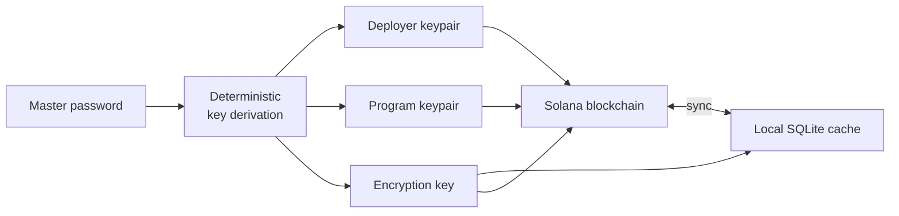

# SoLock

Decentralized password manager that stores encrypted secrets on the Solana blockchain. Single master password, no accounts, no servers - your vault lives on-chain and is accessible from any machine.

## How it works



One password derives everything: your Solana keypair, program ID, and encryption key. Entries are encrypted locally with AES-256-CBC, stored on-chain as opaque blobs, and cached in SQLite for offline access.

## Features

- **Single binary** - Solana program embedded, no external dependencies at runtime
- **Deterministic keys** - same password = same vault on any machine
- **End-to-end encrypted** - data is encrypted before leaving your machine
- **Local-first** - works offline, syncs when connected
- **Terminal UI** - keyboard-driven interface built with [Bubbletea](https://github.com/charmbracelet/bubbletea)
- **Entry types** - passwords, notes, payment cards
- **TOTP support** - 2FA code generation with countdown timer
- **Password generator** - configurable length, character sets
- **Clipboard integration** - copy passwords and TOTP codes
- **Optimistic locking** - safe multi-client access with conflict detection
- **Slot reuse** - deleted entries free up on-chain space

## Quick start

### Prerequisites

- Go 1.24+
- Solana CLI (for deploying)

### Build and run

```bash
make build
./solock
```

### First-time setup

1. Enter a master password
2. Copy the deployer address (`p` key) and fund it with ~3 SOL
3. Deploy the program (`d` key)
4. Initialize the vault (`i` key)
5. Add your first entry (`a` key)

For devnet testing, get free SOL from [faucet.solana.com](https://faucet.solana.com).

## Building the Solana program

The compiled program is already embedded in the Go binary. To recompile:

```bash
make program-build   # requires Docker
make build           # rebuild Go binary with new .so
```

See [docs/building.md](docs/building.md) for details.

## Documentation

- [Architecture](docs/architecture.md) - system design, data flow, on-chain storage model
- [Key Derivation](docs/key-derivation.md) - how master password becomes Solana keys
- [Building](docs/building.md) - build instructions, Makefile targets
- [Usage](docs/usage.md) - screens, keybindings, entry types
- [Solana Program](program/README.md) - on-chain instructions, accounts, conflict detection
- [Go Application](app/README.md) - code structure, dependencies

## Tech stack

| Component | Technology |
|-----------|-----------|
| TUI | Go + [Bubbletea](https://github.com/charmbracelet/bubbletea) / [Lipgloss](https://github.com/charmbracelet/lipgloss) |
| Blockchain | Solana + [Anchor](https://www.anchor-lang.com/) (Rust) |
| Encryption | AES-256-CBC |
| Key derivation | SHA256 + BIP39 + SLIP-0010 |
| Local storage | SQLite (encrypted) |
| TOTP | RFC 6238 |
| Dev environment | Nix |

## Security model

- **No registration** - no email, no phone, no cloud accounts
- **No servers** - SoLock talks directly to Solana RPC
- **No key files** - keys are derived from password on every launch, never stored
- **Memory safety** - keys zeroed on exit
- **Encrypted at rest** - local SQLite values encrypted with AES-256-CBC
- **Encrypted on-chain** - Solana stores opaque encrypted blobs, not plaintext
- **Your program** - each user deploys their own Solana program instance

## License

MIT
