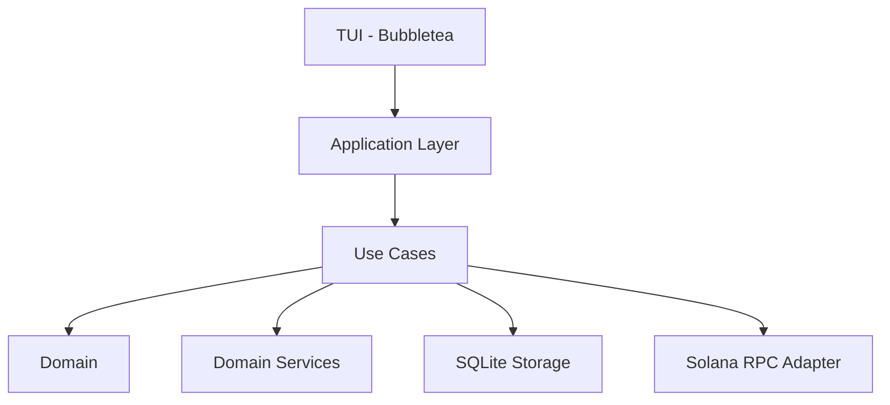
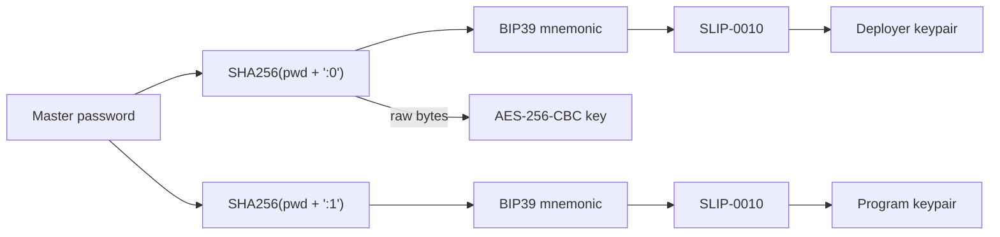
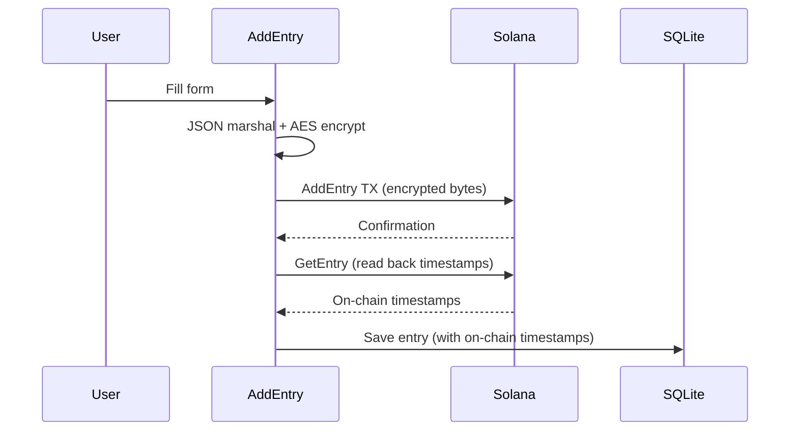
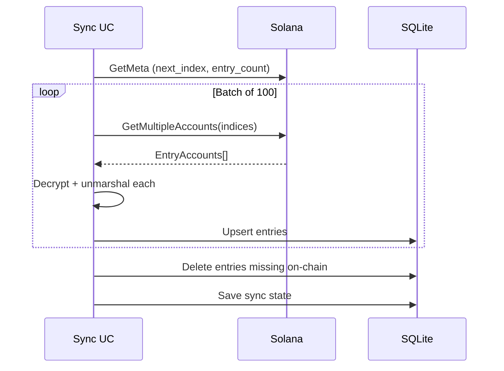
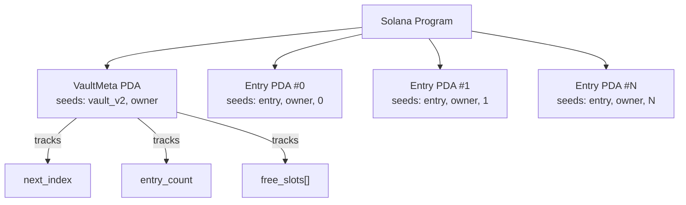

# Architecture

SoLock follows a clean architecture pattern with clear separation between domain logic, use cases, infrastructure and UI.

## High-level overview



## Directory structure

```
solock/
├── program/                    # Solana program (Rust/Anchor)
│   ├── Anchor.toml
│   ├── Cargo.toml
│   └── programs/solock/src/
│       └── lib.rs              # Vault + entry CRUD instructions
├── app/                        # Go application
│   ├── cmd/solock/main.go      # CLI entrypoint
│   └── internal/
│       ├── domain/             # Core entities and interfaces
│       │   ├── service/        # Key derivation, AES encryption
│       │   ├── entry.go        # Entry entity
│       │   ├── repositories.go # Repository interfaces
│       │   └── services.go     # Service interfaces
│       ├── usecase/            # Business logic
│       │   ├── unlock.go       # Master password -> keys
│       │   ├── add_entry.go    # Create entries on-chain
│       │   ├── update_entry.go # Update with optimistic locking
│       │   ├── delete_entry.go # Delete on-chain + local
│       │   └── sync.go         # Bidirectional sync
│       ├── repository/
│       │   ├── adapter/        # Solana RPC + embedded binary
│       │   └── storage/        # SQLite with encryption
│       ├── application/        # Dependency wiring
│       └── api/tui/            # Bubbletea terminal UI
├── docker/                     # Program build environment
│   ├── Dockerfile
│   ├── build.sh
│   └── flake.nix
├── flake.nix                   # Dev environment
└── Makefile
```

## Data flow

### Unlock



### Add entry



### Sync



## On-chain storage model

Each user gets their own vault derived from their deployer public key:



**VaultMeta** fields:
- `owner` - deployer public key
- `next_index` - next unused slot
- `entry_count` - number of active entries
- `free_slots` - deleted slot indices available for reuse (max 200)

**EntryAccount** fields:
- `owner` - deployer public key
- `index` - slot number
- `encrypted_data` - AES-256-CBC encrypted JSON
- `created_at` / `updated_at` - Solana clock timestamps (used for conflict detection)

Slot reuse: when an entry is deleted, its index goes to `free_slots`. Next allocation picks from `free_slots` first, then `next_index`.
