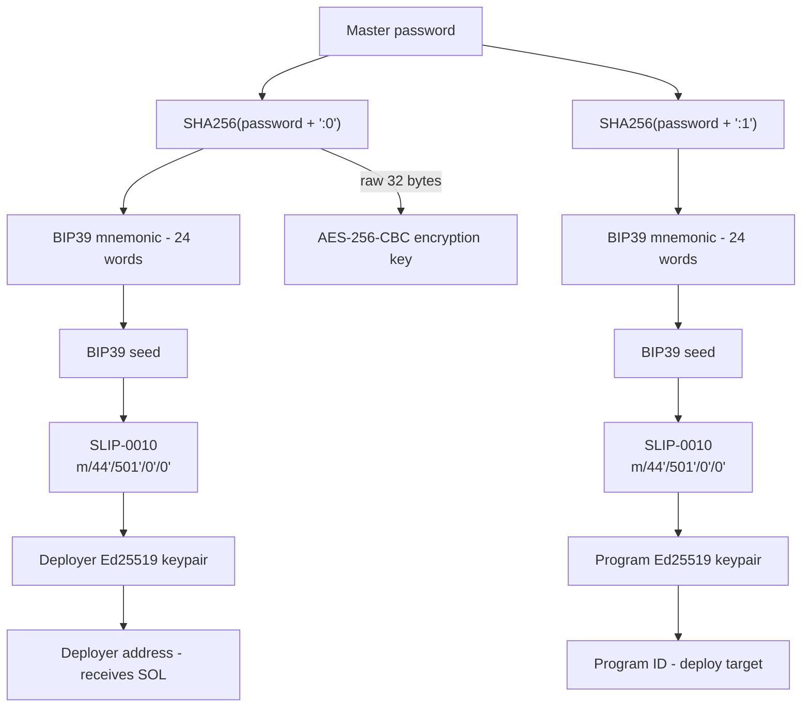

# Key Derivation

SoLock derives all cryptographic material from a single master password. No registration, no accounts, no key files. The same password always produces the same keys - enabling cross-machine access.

## Derivation scheme

## What each key does

| Key | Purpose |
|-----|---------|
| Deployer keypair | Signs all Solana transactions (owner of vault) |
| Deployer address | Receives SOL for transaction fees and rent |
| Program keypair | Determines the program ID for deploy |
| Program ID | Address where the Solana program lives |
| Encryption key | Encrypts/decrypts entry data (AES-256-CBC) |

## SLIP-0010

SLIP-0010 is used instead of BIP-32 because Ed25519 (Solana's curve) doesn't support non-hardened derivation.

The derivation path `m/44'/501'/0'/0'` follows the Solana standard:
- `44'` - BIP-44 purpose
- `501'` - Solana coin type
- `0'` - account index
- `0'` - address index

Each segment uses hardened derivation with HMAC-SHA512.

## Security notes

- SHA256 is used for entropy generation (not Argon2/scrypt) because the output feeds into BIP39 which has its own PBKDF2 step
- Keys are zeroed from memory on shutdown via `DerivedKeys.Zero()`
- The encryption key uses the same entropy as the deployer but bypasses BIP39 - it's the raw SHA256 output
- No key material is ever stored to disk - everything is re-derived on each unlock
